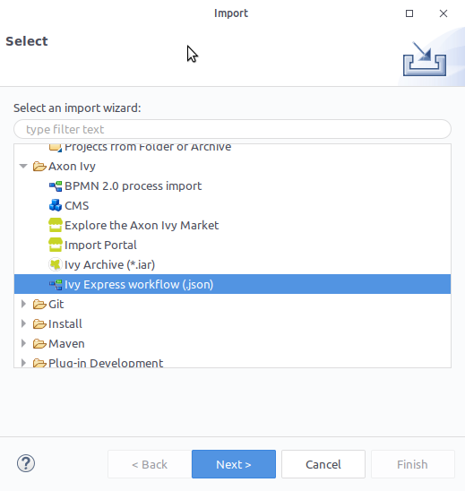
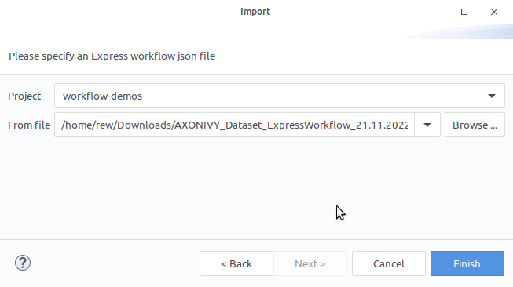
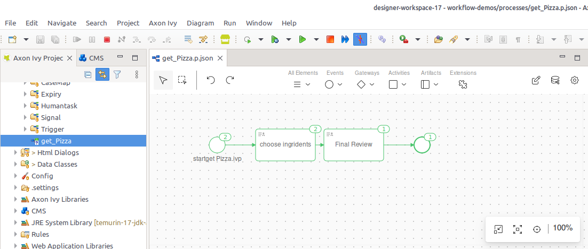

# Axon Ivy Express Importer

Axon Ivy Express enables you – as a business user – to create your own process applications and share them with your colleagues. These capabilities are also known as No-Code Application Platforms or Citizen Developer Platforms. Therefore, it is the perfect tool for you to digitize your processes and create standardization, reliability and traceability. Some of the key features of Axon Ivy Express are:

* It is a **No Coding Toolset**, allowing business users without an IT background to create processes.

* The **Axon Ivy Portal Integration** allows business users to implement processes without IT department involvement.

* The **Seamless Integration** into Axon Ivy allows you to make use of standard features like email notifications, task delegation, etc.

* The **Powerful Toolset** allows you to create processes, define different task types, set responsibilities and due dates and define user dialogs for each task.

You can reach Axon Ivy Express by using the link Processes in the Axon Ivy Portal menu.

You can find the full documentation [here](https://market.axonivy.com/axonivy-express). 

## Demo

1. Login to the Portal
2. Export and download a low-code express Process of your choice as JSON. See [Demo tabs](https://market.axonivy.com/axonivy-express#tab-demo) on Express exporting.
3. Open your Designer, got to `File` > `Import...` > `Axon Ivy` > `Ivy Express Workflow` 
4. Select the target project for the import. And use the previously download express workflow .json as source. 
5. Finish the Wizard
6. Run your and extend your imported Process 
