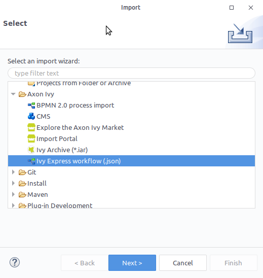
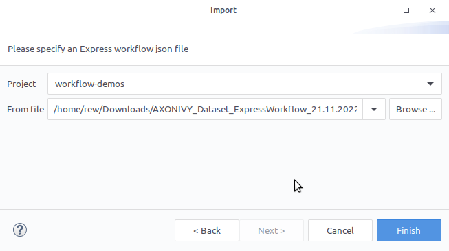
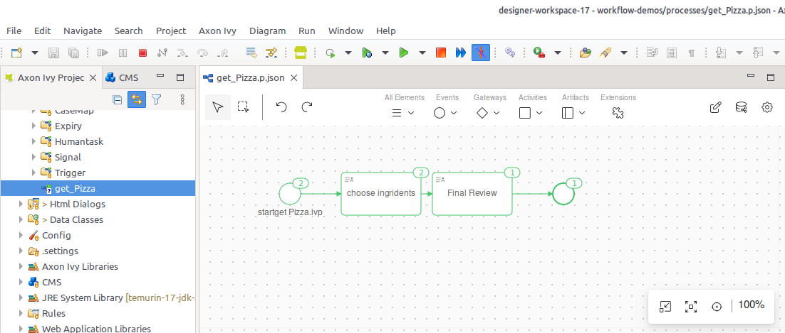

# #Axon Efeu Drückt aus Importeur

#Axon Efeu Drückt aus aktiviert du – da einem dienstlichen Nutzer – zu schaffen
euren eigenen Arbeitsgang Anträge und teilen jene mit euren Kollegen. Diese
Fähigkeiten sind auch da gekannt Nein-Code Antrag Bahnsteige oder Bürger
Entwickler Bahnsteige. Deswegen, es ist als das perfekte Tool du zu
digitalisieren eure Arbeitsgänge und schaffen #Einheitlichkeit, Beständigkeit
und #Rückverfolgbarkeit. #Welche von den wesentlichen Charakterzügen von #Axon
Efeu Drückt aus ist:

* Es ist ein **Kein Programmieren Toolset**, erlaubend dienstliche Nutzer ohne
  einen IT Hintergrund zu schaffen Arbeitsgänge.

* Das **#Axon Efeu Portal Integration** erlaubt dienstliche Nutzer zu
  implementieren Arbeitsgänge ohne IT Abteilung Verwicklung.

* Das **Nahtlose Integration** hinein #Axon #Ivy erlaubt du zu nützen von
  tariflich Charakterzüge gleichnamig #Email Mitteilungen, Task Delegation,
  #usw.

* Das **Kraftvoll Toolset** erlaubt du zu schaffen Arbeitsgänge, definiert
  verschiedene Task Typen, Apparat Verantwortungen und fällige Daten und
  definieren Nutzer Zwiegespräche für jeden Task.

Du können #Axon Efeu ankommen Drückt aus mal die Band Arbeitsgänge benutzen in
den #Axon Efeu Portal Speisekarte.

Du kannst die volle Dokumentation finden
[hier](https://market.axonivy.com/axonivy-express).

**Benutzt den #Express--Importeur** zu importieren eure nein-Code Drückt aus
Workflow von dem Portal hinein einen Designer Workflow Antrag.

## Demo

1. Anmeldung zu dem Portal
2. Ausfuhr und herunterladen eine #blöken-Code #Express- Arbeitsgang von eurer
   Auswahl da JSON. Sieh [Demo
   Deckel](https://market.axonivy.com/axonivy-express#tab-demo) auf #Express-
   ausführend.
3. Öffne euren Designer, bekommen zu `Datei` > `Einfuhr...` > `#Axon Efeu` >
   `Efeu Drückt aus Workflow` 
4. Wähl aus das Soll Projekt für die Einfuhr. Und benutzen das vorher drückt aus
   #Herunterladen workflow .json Wie Quelle.
   
5. Beende den Zauberer
6. Gerannt eure und erweitern euren #eingeführt Arbeitsgang
   
